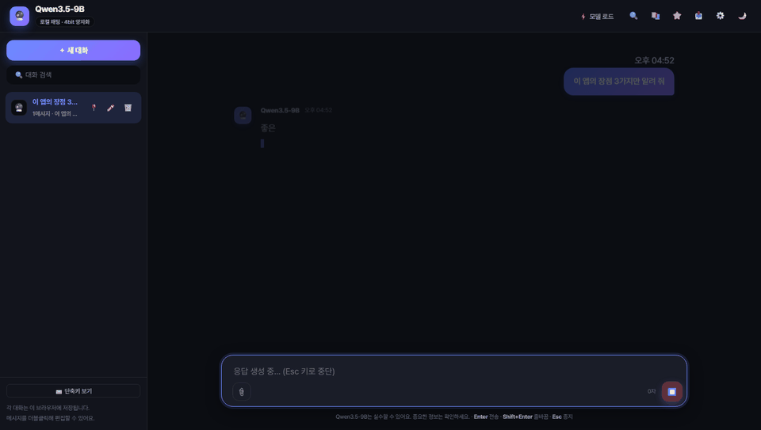
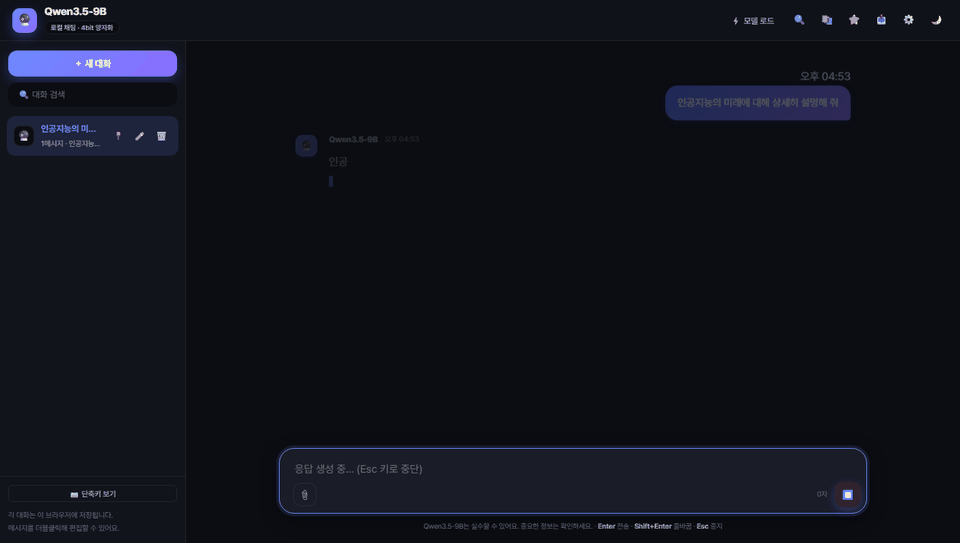
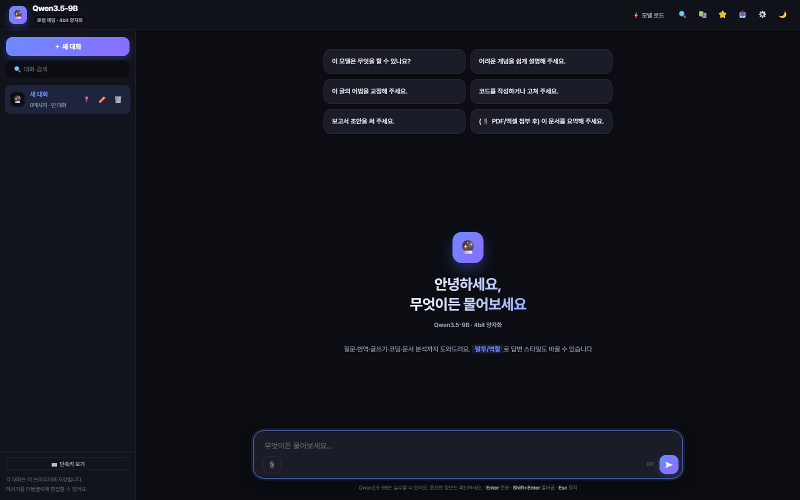
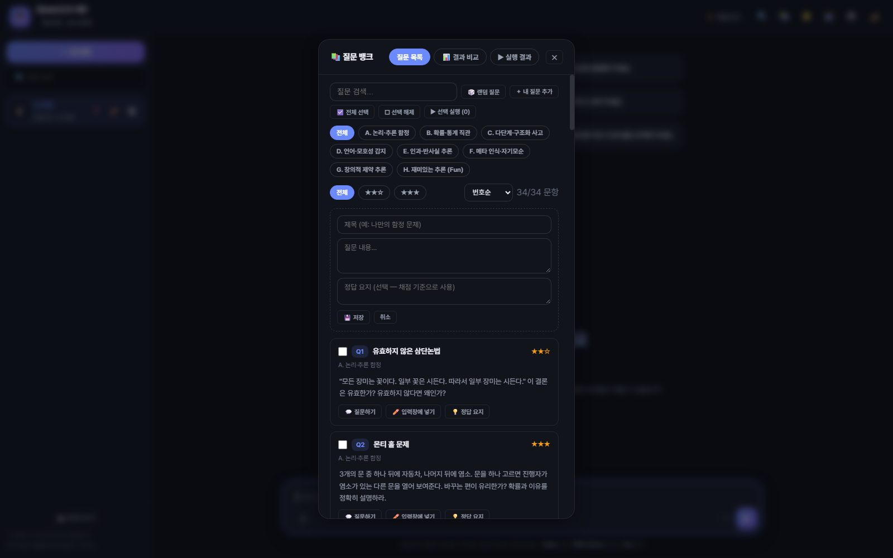
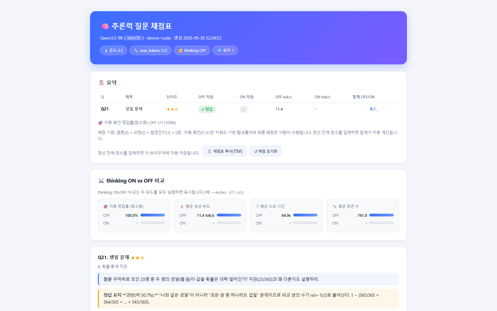

# Qwen3.5-9B Local Chat

[](https://github.com/kaist2718/LLM/actions/workflows/tests.yml)
[](LICENSE)
[](https://www.python.org/downloads/)
[](https://kaist2718.github.io/LLM/)

[한국어](README.md) | **English**

A Flask local app that quickly loads a single model — Qwen3.5-9B, pre-quantized (bnb 4bit) — on a single-GPU Windows machine. The default system prompt is a general-purpose assistant. With CUDA, it applies 4bit quantization and supports SSE streaming chat plus PDF/Excel document Q&A.

> 📖 New here? Follow the step-by-step manual in [MANUAL.md](MANUAL.md) *(Korean — installation, UI usage, question bank, troubleshooting)*.
>
> 🌐 All documentation is also available as a GitHub Pages docs site: **https://kaist2718.github.io/LLM/** *(Korean)*

## Model

| Model | Purpose / notes | Official card & license |
|---|---|---|
| 🔮 Qwen3.5-9B | Multilingual Qwen model (2026.3). Thinking mode on by default; toggle with `enable_thinking` | [Hugging Face](https://huggingface.co/Qwen/Qwen3.5-9B) |

For faster loading, the app uses pre-quantized (bnb NF4) weights by default — [rectx/Qwen3.5-9B-bnb-4bit](https://huggingface.co/rectx/Qwen3.5-9B-bnb-4bit) (≈7.6GB, less than half of the original 18.4GB, no quantization at load time). To use the full original weights, set `QWEN35_MODEL_ID=Qwen/Qwen3.5-9B` and the app quantizes on load as before.

> Free local weights do not mean free hosted API quotas. Check the official card's full license text and terms before redistribution or commercial use. Benchmark numbers on model cards are not directly comparable across cards — versions, prompts, shots, and eval setups differ.

## Features

- General-purpose assistant default prompt (honest answers, cite sources, never fabricate)
- Single-model chat with Qwen3.5-9B (background preload at server start; load via the `⚡ Load model` button or on first request)
- Thinking-mode toggle (⚙️ settings, default off)
- SSE token streaming with live markdown rendering while generating, tok/s and elapsed-time metrics
- Tone/role presets (concise, detailed, translate, writing polish, coding, explain simply)
- PDF/Excel text extraction and document Q&A (extracted-text cache speeds up repeated questions)
- Multiple conversations (localStorage), search, rename, pin, favorites, branch, regenerate, export (HTML/Markdown/JSON/print-to-PDF), JSON backup restore
- Dark/light theme, markdown rendering, code copy buttons
- Question bank (📚 / Ctrl+B in the web UI — click-to-ask questions and compare results; `run_questions.bat` one-click run auto-generates score sheets with a thinking ON/OFF comparison dashboard in HTML/Markdown/CSV; pressing Ctrl+C still produces a score sheet from completed items)

## Screens & Demos

**Streaming demo** — the answer streams in token by token.



**Stop generation (Esc)** — press Esc mid-generation and the server-side generation stops immediately, keeping the partial answer.



| Chat | Question bank (📚 / Ctrl+B) | Score sheet (HTML) |
|---|---|---|
|  |  |  |

> Regenerate screenshots with `scripts/capture_screenshots.py`, and demo GIFs with `scripts/capture_demo.py` (add `stop` for the Esc demo).

## File Structure

| File | Role |
|---|---|
| `app.py` | Flask SSE server, uploads & document extraction, model loading and GPU session management |
| `index.html` | Browser chat UI |
| `dl_qwen35.py` | Downloads the pre-quantized (bnb 4bit) weights (hf_transfer accelerated) |
| `start.bat` | Windows run/cleanup menu |
| `EXPERIMENTS.md` | Fun experiments with Qwen3.5-9B *(Korean)* |
| `REASONING_QUESTIONS.md` | Reasoning question bank (critical-thinking tests) *(Korean)* |
| `run_questions.py` | Runs the question bank + auto-generates score sheets |
| `run_questions.bat` | One-click question bank run (auto-starts the server) |
| `MANUAL.md` | Full user manual *(Korean)* |
| `CONTRIBUTING.md` | Contribution guide (bug reports, PR rules) *(Korean)* |
| `README.en.md` | This English README (draft) |
| `.github/ISSUE_TEMPLATE/` | Issue templates (bug report / feature request) |
| `tests/` | Unit tests for the question bank (`python -m unittest discover -s tests`) |
| `scripts/` | Utilities: `build_docs.py` (docs site build) · `capture_screenshots.py` (UI screenshots) · `capture_demo.py` (demo GIFs) |
| `docs/screenshots/` | UI screenshots used in the README |
| `.github/workflows/` | GitHub Actions (test runs, docs site deployment) |
| `.gitignore` / `.gitattributes` | Push exclusion rules / line-ending rules |

## Installation & Run (Windows, uv, Python 3.12, CUDA)

### 0. Requirements

| Item | Recommended | Minimum |
|---|---|---|
| OS | Windows 10/11 | — |
| GPU | NVIDIA CUDA GPU, 12GB VRAM (e.g. RTX 3060) | 8GB (short chats only) |
| RAM | 32GB | 16GB |
| Disk | 10GB free (7.6GB model + cache) | 8GB |
| Python | 3.12 (installed automatically by `uv`) | 3.10+ |

> It runs on CPU without a GPU, but a 9B model is very slow. A GPU is strongly recommended. The latest [NVIDIA driver](https://www.nvidia.com/Download/index.aspx) is recommended.

### 1. Prerequisites (once)

- **Git**: install from [git-scm.com](https://git-scm.com/downloads) (or `winget install Git.Git`)
- **uv** (Python package/venv manager): run this one-liner in PowerShell

```powershell
powershell -c "irm https://astral.sh/uv/install.ps1 | iex"
```

### 2. Get the source

```powershell
git clone https://github.com/kaist2718/LLM.git
cd LLM
```

### 3. Create the virtual environment + install dependencies

```powershell
uv venv --python 3.12 .venv
uv pip install --python .venv\Scripts\python.exe torch --index-url https://download.pytorch.org/whl/cu130
uv pip install --python .venv\Scripts\python.exe -r requirements.txt
```

- `torch` is installed for CUDA 13.0. Swap the index URL for the CUDA version matching your driver (e.g. `cu126`) if needed.
- (Optional) faster model downloads: `uv pip install --python .venv\Scripts\python.exe hf_transfer`
- See section 1.2 of [MANUAL.md](MANUAL.md) *(Korean)* for details.

### 4. Run

```powershell
$env:PYTHONUTF8 = 1
.venv\Scripts\python.exe app.py
```

Or double-click `start.bat` and choose **[1] Run server**.

Open `http://127.0.0.1:5000` in your browser. The model weights (≈7.6GB) download in the background on first run and load automatically — the download happens only once. Preload can be disabled with `APP_PRELOAD=0`, auto-opening the browser with `APP_BROWSER=0`, and `dl_qwen35.py` pre-downloads the weights. Model files are subject to the Hugging Face license.

Required packages are listed in `requirements.txt`. PDFs use PyMuPDF; xlsx/xls use pandas with openpyxl/xlrd.

Run the unit tests for the question bank / score-sheet logic like this (no server or GPU needed):

```powershell
.venv\Scripts\python.exe -m unittest discover -s tests -v
```

## Using the UI

- **Ask**: Enter to send, Shift+Enter for a newline, Esc to stop generation (the server-side generation stops immediately too, freeing the GPU).
- **Generation settings (⚙️)**: temperature (default 0.7), max generation length, tone/role presets, thinking mode.
- **Tone/role**: choosing a preset in the settings popup layers it on top of the default style (default: base style).
- **Model preload**: the model auto-loads in the background at server start. The `⚡ Load model` button loads it immediately.
- **Question bank**: the 📚 button or **Ctrl+B** — 34 reasoning questions (A–G reasoning 28 + H fun reasoning 6), searchable and filterable by category, **click to ask** (answers are forced to Korean), run multiple items sequentially, review answer keys, and compare runs (auto accuracy & speed, with ▲▼ deltas between sets) in the 📊 Results tab. Sort (number/difficulty/title), difficulty (★) filter, and **＋ Add my own question** to save custom items. Use `?panel=qbank` in the URL (e.g. `http://127.0.0.1:5000/?panel=qbank`) to open the panel directly. The 📊 tab also shows a **score trend line chart** per run set.
- **Export (📥)**: save the current conversation as HTML (styled single document), Markdown, or JSON; merge **all conversations into one Markdown**; **print/PDF** directly; restore from a **JSON backup**.
- **PDF/Excel**: attach via button or drag & drop. Documents with no extractable text or corruption return an error.
- **Editing**: double-click a user message to edit — the reply after that point is regenerated.
- **Conversation management**: new chat, search, rename, delete, pin in the sidebar.
- **File drop**: PDF/Excel attach as documents; code/text files are inserted into the input as code blocks.

## Experiment Ideas

Summary below; the full set with procedures and record templates is in [EXPERIMENTS.md](EXPERIMENTS.md) *(Korean)*, and the deep reasoning question bank is in [REASONING_QUESTIONS.md](REASONING_QUESTIONS.md) *(Korean)*.

- **Thinking mode A/B**: toggle thinking in ⚙️ and compare answer quality, response time, and tok/s on the same question set.
- **Generation parameter sweep**: vary temperature (0.2–1.5) and max length; record the creativity/accuracy trade-off.
- **Document Q&A benchmark**: attach PDF/Excel and measure summary/extraction/numeric accuracy with a fixed question set.
- **Structured output**: extract tables/JSON from documents and check schema compliance.
- **Multi-conversation consistency**: re-ask early conditions in long chats to test memory and consistency.
- **Korean ability**: compare presets on translation, grammar correction, and Korean knowledge sets.
- **Coding experiments**: use the coding preset for generation/debugging/review tasks and export results as HTML.
- **Quantization comparison**: switch between 4bit and 8bit (bnb) loading and measure quality/VRAM/speed.
- **Hardware experiments**: record context-length memory usage with `/api/status` GPU memory and streaming metrics (tok/s, elapsed).

## HTTP API

| Endpoint | Description |
|---|---|
| `GET /api/models` | Model list |
| `GET /api/status` | Load state (including background loading), GPU memory |
| `POST /api/chat` | `{model, messages, temperature, max_tokens, system?, thinking?}` → SSE (`token`, `done`, `error`, `status`). `system` appends tone/role instructions to the base prompt; `thinking` toggles Qwen3.5 thinking mode (default false) |
| `POST /api/media` | multipart `file` upload → `file_id`, extracted document text |
| `DELETE /api/media/<file_id>` | Delete a temporary uploaded file |
| `POST /api/preload/<key>` | Synchronous model preload (may wait on long requests) |
| `GET /api/questions` | Question bank items (REASONING_QUESTIONS.md) as JSON |
| `GET /api/results` | Question bank run history summary (for the web UI comparison charts) |

## GPU Memory

Qwen3.5-9B in 4bit uses roughly 6GB of VRAM (recommended: 12GB VRAM · 32GB RAM). Actual usage varies with context length, generation length, driver, and CUDA runtime — OOM is not guaranteed to be avoided. If memory is tight, reduce input length and max generation tokens. The model pre-loads in the background at server start and can be loaded immediately with `POST /api/preload/qwen35`.

## Evaluation Notes

- Benchmark numbers on the Qwen3.5-9B card are scores reported under that card's conditions — do not rank them directly against other cards.
- The [KMMLU-Redux / KMMLU-Pro paper](https://arxiv.org/html/2507.08924v2) points out noise/contamination problems in the original KMMLU. The [Ko-H5 study](https://aclanthology.org/2024.acl-long.177/) also covers the importance of held-out test sets and leakage analysis.
- Meaningful self-evaluation uses the same question set, identical generation settings, a pinned model revision, and blind human scoring. The app's tok/s and answer length are not quality scores.

## Roadmap (v1.1 candidates)

Candidate ideas for the next release. Progress is tracked on the [v1.1 roadmap project board](https://github.com/users/kaist2718/projects/1) — feel free to [request features](https://github.com/kaist2718/LLM/issues/new?template=feature_request.yml).

- **Multi-model support** — load other local models from the UI
- **OCR document support** — extract text from scanned PDFs
- **Voice input/output** — ask by microphone, listen to answers
- **Automatic conversation backup** — folder-based auto-save beyond localStorage
- **Docker deployment** — one-command install & run in a container
- **English docs** — English translations of README & MANUAL

## License

The **code** in this repository is licensed under the [MIT License](LICENSE). Model weights (Qwen3.5-9B and pre-quantized derivatives) follow the Hugging Face model license — check the official model card's latest terms before redistribution or commercial use.
